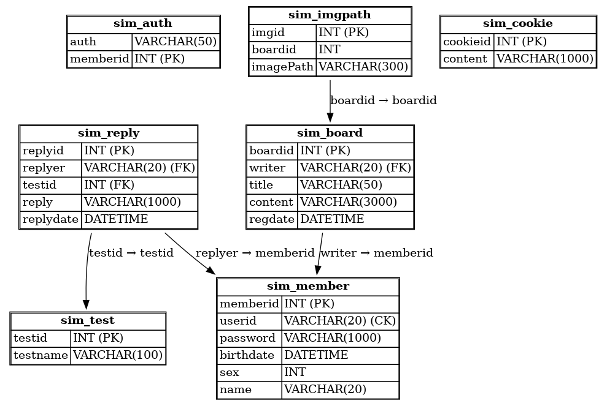

# Spring Framework Backend Portfolio
***
## 🎯 GitHub URL
### https://github.com/BHKyung3/Spring-Framework_pj
***
## 🎯 프로젝트 소개
### ✅ 기획 배경
#### 일상에서 소소한 재미를 볼 수 있는 콘텐츠가 부족하다고 생각되어 착안하게 되었습니다.
### ✅ 구현 목표
#### 간단한 테스트를 통해 자신에 대해 흥미롭게 탐색하고 공유할 수 있는 심리테스트 플랫폼을 구축한다.
### ✅ 개발 기간 및 인원
#### 2025년 6월 13일(금) ~ 2025년 07월 04일(금)   총 4명이서 작업 진행
***
## 🎯 기술 스택 및 구조도
### ✅ 프론트엔드 (Frontend)
#### HTML5   CSS   JavaScript   jQuery

### ✅ 백엔드 (Backend)
#### Java 11   Spring Framework 5.2.7   Spring Security 5.2.7   MyBatis3.5.19   MySQL

### ✅ 웹 서버 (Web Server)
#### Apache Tomcat 9

### ✅ 배포 (Deployment)
#### GitHub

### ✅ 개발 도구 및 환경
#### Apache Maven 2.5.1   JSP

***
## 🎯 ERD 구조

***
## 🎯 맡은 역할
***
## 🎯 구현 기능 및 설명
***
## 🎯 어려웠던 점과 해결하면서 느낀점
***
## 🎯 개선사항