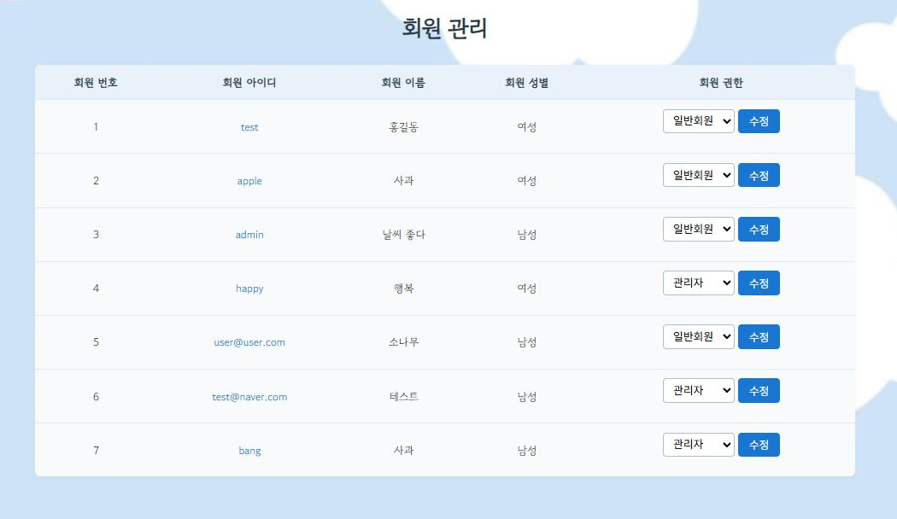
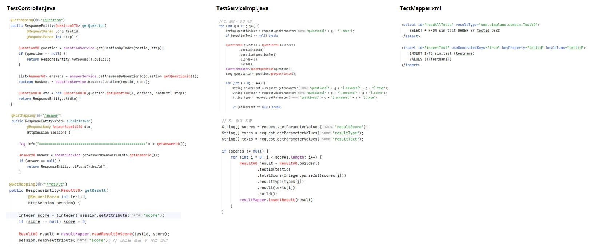

# Spring Framework Backend Portfolio
***
# 🔗 GitHub URL
### https://github.com/BHKyung3/Spring-Framework_pj
***
## 📝 프로젝트 소개
### ✅ 기획 배경
#### 일상에서 소소한 재미를 볼 수 있는 콘텐츠가 부족하다고 생각되어 착안하게 되었습니다.
### ✅ 구현 목표
#### 간단한 테스트를 통해 자신에 대해 흥미롭게 탐색하고 공유할 수 있는 심리테스트 플랫폼을 구축한다.
### ✅ 개발 기간 및 인원
#### 2025년 6월 13일(금) ~ 2025년 07월 04일(금)   팀 프로젝트로 총 4명이서 작업 진행
***
## 🛠️ 기술 스택 및 구조도
### ✅ 프론트엔드 (Frontend)
#### HTML5   CSS   JavaScript   jQuery

### ✅ 백엔드 (Backend)
#### Java 11   Spring Framework 5.2.7   Spring Security 5.2.7   MyBatis3.5.19   MySQL

### ✅ 웹 서버 (Web Server)
#### Apache Tomcat 9

### ✅ 버전관리 (Version Control)
#### GitHub

### ✅ 개발 도구 및 환경
#### Apache Maven 2.5.1   JSP

***
## 🗺️ ERD 구조
### ✅ 데이터베이스의 테이블과 컬럼에 대한 설명표

#### 💡 해당 표는 프로그램의 자세한 규칙을 설명하고 있습니다.   예를 들어, 회원 정보가 어떤 칸에 어떤 종류의 데이터로 저장되는지 한 눈에 확인 가능합니다.
 

### ✅ 데이터베이스 설계도

#### 💡 회원, 게시판, 댓글, 이미지 등 여러 정보들이 담긴 표들이 서로 어떻게 연결되어 있는지 보여주며, 프로그램의 전체적인 데이터 구조를 이해하는 데 도움을 줍니다.
 

### ✅ 테이블 설명
#### 📋 sim_member(회원 테이블)
- 설명 : 회원의 기본 정보와 로그인 정보를 저장하는 테이블로 memberid를 기반으로 회원을 식별하고, userid, password, birthdate 등의 정보를 저장한다.
#### 📋 sim_board(게시판 테이블)
- 설명 : 회원의 기본 정보와 로그인 정보를 저장하는 테이블로 boardid로 게시글을 구분하고, writer를 통해 작성 회원과 연결되며 제목과 내용 등을 저장한다.
#### 📋 sim_reply(댓글 테이블)
- 설명 : 테스트나 게시글에 대한 댓글을 저장하는 테이블로 replyid로 댓글을 식별하고, replyer와 testid를 통해 회원과 테스트에 연결된 댓글 내용을 저장한다.
#### 📋 sim_test(테스트 테이블)
- 설명 : 심리테스트 자체를 정의하는 테이블로 testid를 기준으로 테스트를 식별하고, testname을 통해 테스트 제목을 관리한다.
#### 📋 sim_imgpath(이미지 경로 테이블)
- 설명 : 게시글에 첨부된 이미지의 경로를 저장하는 테이블로 imgid로 이미지를 구분하고, boardid를 통해 게시글에 연결된 이미지 경로를 저장한다.
#### 📋 sim_auth(회원 권한 테이블)
- 설명 : 회원의 권한 정보를 저장하는 테이블로 memberid와 auth를 조합하여 회원의 권한 정보를 정의하고 관리한다.
#### 📋 sim_cookie(포춘쿠기 데이터 테이블)
- 설명 : 포춘쿠키에 사용되는 데이터를 저장한 테이블로 노출되는 명언을 가지고 있다.

***
## 👨‍💻 맡은 역할
### ✅ 게시글과 댓글 기능의 조회 및 수정 로직 구현
- Controller–Service–Mapper 계층 구조를 적용하여, 게시판과 댓글의 수정/조회 흐름을 처리하고, MyBatis 동적 SQL을 활용해 페이징/조건 조회 기능을 구현했습니다.
### ✅ 포춘쿠키 명언 조회 기능 구현
- Controller를 통해 명언 데이터를 요청하고 View에 랜덤으로 출력되는 로직을 구현하여, 테스트 외의 부가적인 사용자 경험 요소를 추가했습니다.
### ✅ Spring Security 기본 로그인 화면을 커스터마이징하여 직접 JSP + CSS로 로그인 화면 구성
- Spring Security의 기본 로그인 페이지를 별도 컨트롤러 및 커스텀 로그인 페이지를 생성해 구성한 웹 페이지와 이미지가 비슷한 로그인 화면이 보일 수 있도록 개선하였습니다.
### ✅ 회원가입 화면 JSP + CSS 구성 및 연동 처리
- 회원가입 페이지에 입력값에 대한 프론트엔드 스타일링과 폼 처리 흐름을 구성했습니다.

***
## 🚀 구현 기능 및 설명
#### 📌 프로젝트의 주요 기능들을 중심으로 사용자 경험과 관리자 편의성 강화를 위해 구현한 핵심 로직을 정리하여 소개 드리겠습니다.
### 📋 사용자와 관리자 권한 분리 로그인 구현
- Spring Security 기반 로그인 처리. 사용자는 일반 서비스 접근, 관리자는 테스트생성/회원 관리 접근 가능하도록 구현하였습니다.
#### ✅ [관리자 화면]

#### ✅ [사용자 화면]

#### ✅ [사용 코드 및 설명]

- 이 코드는 Spring Security와 JSP의 <sec:authorize> 태그를 통해 관리자와 일반 사용자 권한에 따라 접근 가능한 URL과 메뉴를 구분하는 방식으로
XML 설정에서는 URL로 권한을 제한하고, JSP에서는 로그인한 사용자의 역할에 따라 관리자 전용 메뉴(테스트 생성, 회원 관리)를 화면에 표시되도록 작성하였습니다.
   
#### ✅ [테스트 등록 화면] - 관리자 로그인

#### ✅ [사용 코드 및 설명]

- 관리자 권한으로 심리테스트를 등록할 수 있도록 POST 요청을 처리하는 컨트롤러, 서비스, 매퍼를 분리하여 설계했습니다.
  입력된 테스트명은 Mapper를 통해 DB의 sim_test 테이블에 저장되며, 등록 후 테스트 목록 페이지로 리다이렉트됩니다.
  Spring MVC의 기본 흐름에 따라 Controller–Service–Mapper 계층 구조를 적용하였습니다.
#### ✅ [회원관리 화면] - 관리자 로그인

#### ✅ [사용 코드 및 설명]

- 관리자는 회원 목록 페이지를 통해 모든 회원 정보를 조회하고 각 회원의 권한을 수정할 수 있도록 구현했습니다. 
수정된 권한은 sim_auth 테이블에 반영되며, 회원 정보와 권한은 LEFT OUTER JOIN을 통해 함께 조회됩니다.
이러한 구조로 실시간 권한 관리 기능을 제공하여 운영효율성과 유연성이 향상되도록 하였습니다.
     
### 📋 회원가입 기능
- 사용자 정보 입력 시, 정보 보호를 위해 비밀번호 암호화 후 DB 저장되도록 구현하였습니다.
#### ✅ [회원가입 화면]

#### ✅  [데이터베이스 member_table 화면]

#### ✅ [사용 코드 및 설명]

- 회원가입 요청이 들어오면 Controller에서 사용자 입력값을 받아 유효성 검사를 수행하고 
  Service에서는 중복 아이디 확인, 비밀번호 암호화, 권한 설정 등의 비즈니스 로직을 처리합니다.
  최종적으로 Mapper를 통해 DB에 회원 정보와 권한 정보를 저장하며, 계층 간 역할을 분리하여 작성하였습니다.
     
### 📋 문의게시판 CRUD 및 이미지 업로드, 이미지 경로 DB 저장
- 작성자 기준으로 권한 확인 후 글 수정/삭제가 가능하도록 구현하였습니다.
- 게시글 작성 시 업로드한 이미지 경로를 DB에 저장하고 출력되도록 구현하였습니다.
#### ✅ [문의게시판 등록 화면]

#### ✅ [문의게시판 리스트 화면]

#### ✅ [데이터베이스 imgpath_table 화면]

#### ✅ [사용 코드 및 설명]

- 게시글 등록 시 이미지 경로를 함께 전달받아 ImgPathVO 리스트로 변환한 후, 별도의 서비스 로직을 통해 DB에 저장되도록 구현하였습니다.
  게시글의 boardid를 기준으로 이미지 경로를 sim_imgpath 테이블에 연동 저장하며, 등록, 수정, 삭제 시 트랜잭션으로 함께 처리됩니다. 
요청부터 DB저장까지 기능별로 분리된 구조를 적용하여 유지보수성을 높였습니다.
   
#### ✅ [문의게시판 상세 화면] - 본인 작성 게시글

#### ✅ [문의게시판 상세 화면] - 타인 작성 게시글

#### ✅ [사용 코드 및 설명]

- 로그인한 사용자의 권한을 기반으로 게시글 수정 버튼의 노출 여부를 제어하도록 구현했습니다.
  Spring Security의 <sec:authentication>과 <sec:authorize> 태그를 사용해 로그인한 사용자 정보를 JSP에서 활용할 수 있도록 설정하였고
  작성자와 로그인 사용자가 일치할 때만 수정 버튼이 표시되며, 사용자 권한에 따른 UI 제어가 가능합니다.
     
### 📋 댓글 등록 및 수정 기능 구현
- 댓글 CRUD 가능. 각 댓글은 게시글 및 사용자와 연동되어 진행되도록 구현하였습니다.
#### ✅ [댓글 등록 화면]

#### ✅ [댓글 수정 화면]

#### ✅ [사용 코드 및 설명]

- 댓글 등록 및 수정 기능은 게시글과 동일한 계층으로 구성되어 있으며, JSON 데이터를 받아 DB에 저장하거나 수정합니다.
    댓글 목록은 특정 테스트 ID를 기준으로 페이징 처리되어 조회되며, SQL 쿼리로 효율적인 데이터 조회가 가능합니다.
     
### 📋 심리테스트 기능
- 관리자 로그인 후 등록한 테스트를 실제로 해볼 수 있는 페이지로 사용자의 입력에 따라 결과가 출력되도록 구현하였습니다.
#### ✅ [심리테스트 목록 화면]

#### ✅ [테스트 결과 화면]

#### ✅ [사용 코드 및 설명]

- 사용자는 /test/question 요청을 통해 단계별 질문과 답변을 비동기 방식으로 받아 응답하며, 선택한 보기의 점수는 세션에 누적됩니다.
  테스트 종료 시 누적 점수를 기준으로 결과를 조회하고 /result API를 통해 사용자에게 응답하는 구조로 구성했습니다.
     
### 📋 포춘쿠기 명언 랜덤 출력 기능
- 유쾌한 명언을 랜덤, 비동기 형식으로 불러와 노출되도록 구현하였습니다.
#### [포춘쿠키 화면]

#### [코드 및 설명]

- 사용자가 페이지에 접근하면 /random API를 통해 DB에 저장된 명언 목록 중 하나를 무작위로 추출해 전달합니다.
  Service에서는 CookieMapper를 통해 전체 명언 리스트를 가져오고, Random 클래스를 활용해 랜덤 인덱스로 선택하고 명언은 JavaScript와 Ajax를 통해 모달에 출력되며, 사용자에게 포춘쿠키처럼 전달되는 UI를 구현하였습니다.
***
## 🔍 어려웠던 점과 해결하면서 느낀점
#### 포춘쿠키 기능을 구현하던 중, 사용자 경험 향상을 위해 기존 팝업창 방식을 모달창으로 변경하게 되었습니다. 하지만 모달 환경에서는 window.open() 등 기존 팝업 제어 코드가 정상적으로 동작하지 않아 기능 오류가 발생했습니다. 이 문제를 해결하기 위해 HTML 요소를 직접 제어하는 방식으로 JavaScript 코드를 전면 수정하였고, 기능이 안정적으로 작동하는 것을 확인할 수 있었습니다.   또 다른 이슈로는 페이징 기능 구현 시 getTotalCount() 메서드를 단순히 조회수로 오해해 생략한 바람에 페이지가 정상 출력되지 않는 문제가 발생했습니다. 해당 메서드는 전체 데이터 개수를 기반으로 페이징 계산을 위한 핵심 요소임을 뒤늦게 인지하고, 코드를 수정하여 문제를 해결할 수 있었습니다.
#### 이러한 경험을 통해 단순히 기능이 동작하는 것에 그치지 않고, 각 기술의 목적과 동작 원리를 이해하는 것이 중요하다는 점을 다시 한 번 배울 수 있었습니다. 또한 구현 방식이 화면 구성 방식이나 사용자 흐름에 따라 얼마든지 달라질 수 있다는 점도 깊이 체감하게 되었습니다.

***
## 📈 개선사항
| 항목        | 이유                                           | 기대 효과                                               |
|-----------|----------------------------------------------------|----------------------------------------------------------|
| 로그인 여부 모달창 표시 | 로그인 성공/실패 여부에 대한 피드백이 없어, 사용자가 로그인이 제대로 되었는지 인지하기 어려움            | 로그인 성공 여부에 대한 명확한 안내 제공으로 사용자 편의성 및 접근성 향상.                       |
| 검색 기능 고도화 | 게시글 또는 테스트 목록의 키워드 검색 기능이 부족하거나 단순함                | 	사용자 신뢰도 향상, 악의적 사용 방지                       |
| 댓글 수정/삭제 이력 관리 | 댓글 내용 변경 시 이력이 남지 않아 책임소재 파악이 어려움                | 사용자 편의성 향상, 원하는 정보 빠르게 접근 가능                       |
| 테스트 통계 기능 | 결과만 단순 출력되고 유형별 응답 분석 없음                | 사용자 흥미 유도, 테스트 개선 방향 도출                       |
| 테스트 결과 시각화 | 현재는 텍스트만 출력되어 시각적 임팩트 부족                | 차트 시각화로 이해도 및 사용자 만족도 향상                    |
| 마이페이지 기능  | 내가 쓴 글, 댓글, 결과 등을 한눈에 보기 어려움              | 개인화 서비스 제공, UX 향상                                 |
| 궁합 기능 구현  | UI는 존재하지만 기능 미구현                              | 포춘쿠키 외 부가 기능 추가로 재미 요소 강화                   |
| 다국어 지원    | 한글만 지원되어 글로벌 사용 어려움                        | 사용자층 확장, 포트폴리오 차별화 요소                         |
| 관리자 알림 기능    | 현재는 회원가입, 테스트 응답 등 주요 이벤트 발생 시 관리자에게 별도 알림이 없음.                  | 실시간 알림을 통해 빠른 대응이 가능하고, 운영 효율이 향상됨.                        |
| 이메일 인증 회원가입  | 이메일 인증 절차가 없어 잘못된 가입이나 스팸 유입 가능성이 있음.                    | 실제 사용자만 가입 가능하게 되어 보안이 강화되고 신뢰도가 높아짐.                     |
| 반응형 웹 적용 | 모바일 환경에서는 UI가 깨지거나 조작이 불편할 수 있음 | 다양한 디바이스에서 접근 가능, 접근성 및 사용성 향상 |
| 테스트 결과 공유 기능 | 결과를 저장하거나 공유할 수 있는 기능이 없음 | 사용자가 흥미를 느끼고 SNS 공유로 유입 증가 기대 |
| 사용자 활동 로그 기록 | 누가 언제 어떤 테스트를 했는지 로그가 기록되지 않음 | 사용자 분석 및 향후 통계 기능 확장 기반 마련 |
***
## ✨ 프로젝트를 통해 얻은 성장
#### 처음에는 요구사항을 정리하고 ERD를 설계하는 것부터, 기능을 나누고 책임을 분리하는 구조 설계까지 모든 과정이 낯설고 어렵게 느껴졌습니다.
#### 하지만 화면과 로직을 직접 구현하고 연동하는 과정을 통해 전체 흐름을 자연스럽게 익힐 수 있었고,  Spring, MyBatis, Ajax 등 실무에서 자주 사용하는 기술들을 활용해보며 실질적인 개발 역량을 키울 수 있었고   이러한 경험은 백엔드 개발자로 성장하는 데 큰 밑거름이 되었다고 생각합니다.